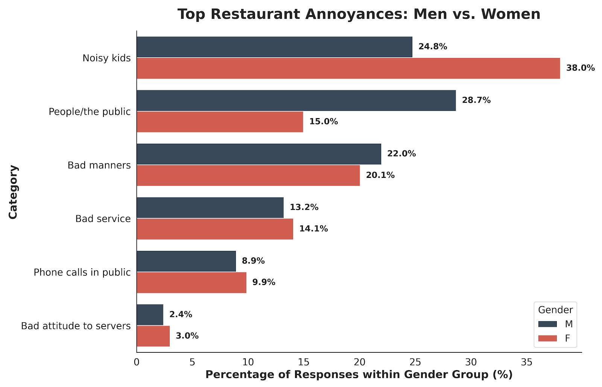

> [!NOTE]
> **Abstract**  
> A quantitative exploratory analysis of 900 public responses regarding restaurant environment annoyances. Bridging raw text wrangling, statistical validation, and behavioral science, the project investigates how sensory triggers, implicit social etiquette, and environmental density are filtered through distinct biological and demographic models.
# Public Space Sensory Stressors & Behavioral Analytics


## Overview
This repository presents a quantitative exploratory analysis of $\sim 900$ public responses regarding dining and restaurant environment annoyances. Bridging raw text wrangling, statistical validation, and behavioral science, the project investigates how sensory triggers, implicit social etiquette, and environmental density are perceived across different demographic and gender groups.

---

## Key Results & Visualization

<p align="center">
  
</p>

### Key Behavioral Insights:
1. **Sensory Prioritization & Child Noise:**
   * Women in the dataset were significantly more likely to identify "Noisy Kids" as their primary irritant ($38.0\%$ vs. $24.8\%$ for men). 
   * This aligns with neurobiological research regarding attentional systems and evolutionary responsiveness to distress-related audio cues.

2. **"The Public" as a Diffuse Stressor:**
   * Predominantly male respondents ($28.7\%$ vs. $15.0\%$ for females) cited generic social presence ("People/the public") as a primary annoyance.
   * This reflects a conceptual framing of overall social density as a loss of psychological territory and distance.

3. **Universal Social & Etiquette Baselines:**
   * Violations of implicit social rules (bad table manners at $\sim 20\%$) and commercial baselines (poor service, intrusive phone calls, and staff disrespect) carried nearly identical statistical weight across genders, functioning as universal violations of shared norms.

---
## Prompt Template for Text Classification

1. **Gender Inference:**
   * Infer responder gender (`M` or `F`) based on the provided name; extract the first name for data auditing purposes and drop middle and second names to guarantee respondent anonymization.
   * If gender cannot be determined with high confidence, flag as `NULL` / `Unknown`.

2. **Multi-Factor Normalization (1-to-Many Explode Rule):**
   * Analyze the comment text for one or more reported annoyance factors.
   * If a respondent cites multiple annoyances, create a distinct record for **each** identified factor while preserving the original respondent metadata (Name, Inferred Gender).

3. **Closed Taxonomy Classification:**
   * Map each extracted annoyance strictly to one of the following six closed categories:
     - `Noisy kids`
     - `People/the public`
     - `Bad manners`
     - `Bad service`
     - `Phone calls in public`
     - `Bad attitude to servers`

**Constraint:** Provide results in CSV format.
---

## Data & Qualitative Classification Methodology

The original dataset comprised unstructured open-ended survey entries (~900 records). An AI-assisted qualitative coding framework was implemented to extract structured parameters:

1. **Taxonomy Formulation:** Using structured prompt engineering, raw text entries were mapped into mutually exclusive analytical categories (`Sensory Triggers`, `Social Density`, `Etiquette Violations`, `Service Quality`).
2. **Categorical Mapping:** An LLM was utilized for zero-shot text classification, parsing unstructured natural language entries into standardized categorical labels.
3. **Validation & Auditing:** Automated classifications were manually spot-checked and audited against physical ground truth to correct misinterpretations, sarcasm, and edge cases prior to statistical analysis.
4. **Data Wrangling & Standardization:** Python (`pandas`) was used to clean string data, encode demographic variables, and compute proportional cross-tabulations.
5. **Visualization:** Custom `Seaborn` scripts were written to render publication-grade comparative bar charts.

---

## Repository Roadmap & Project Status

- [x] **Data Collection & Categorization:** ~900 survey records processed.
- [x] **Exploratory Data Analysis & Visualization:** Proportional gender splits computed and plotted.
- [x] **Project Brief & Overview:** Published via `README.md`.
- [x] 📓 **Jupyter Notebook:** [Restaurant.ipynb](./Restaurant.ipynb).
- [x] 📥 **Download / View Dataset:** [restaurant_annoyances_data.csv](./facebook_restaurant_annoyances.csv).

---

## Project Structure

```text
restaurant-annoyance-behavioral-analytics/
├── data/
│   ├── raw/                      <- [Pending] Anonymized survey exports
│   └── processed/                <- [Pending] Categorized dataset CSV
├── notebooks/
│   ├── 01_data_cleaning.ipynb    <- [Pending] Data cleaning & NLP pipeline
│   └── 02_eda_visualization.ipynb <- [Pending] Proportional analysis & Seaborn scripts
├── visuals/
│   └── RESTAURANT.png            <- Published comparative distribution plot
├── README.md                     <- Project homepage
└── LICENSE                       <- MIT License
